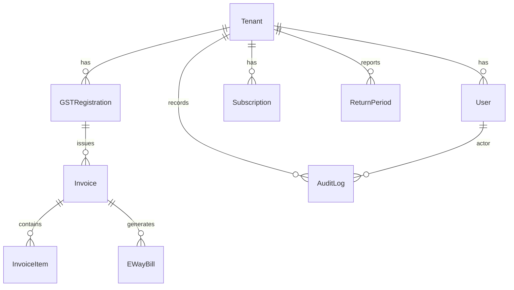

# GST Compliance SaaS MVP Blueprint

This document distills the MVP requirements into a ready-to-build package for an engineering team. It covers a contractual overview, API skeleton, relational schema, UI/component guidelines, and integration bill-of-materials (BOM) with a sandbox/Postman outline.

---

## 1. Product Overview & Scope Guardrails

- **Audience**: Indian GST-registered businesses that must file GSTR-1 and GSTR-3B and need e-invoicing/e-way compliance.
- **Deployment**: Private SaaS per tenant (PAN). Secure multi-tenant design with per-GSTIN scoping and immutable audit trails.
- **Key features**: Invoicing with IRP integration, e-way bill generation, GSTIN verification, automated GSTR-1/GSTR-3B summaries, dashboards, subscription management, and admin console with RBAC + 2FA.
- **Compliance guardrails**: Configurable turnover thresholds for e-invoicing, audit locking for post-filing periods, secure storage of government API credentials, and adherence to data residency (deploy in India region by default).

---

## 2. OpenAPI Skeleton (selected endpoints)

Below is a trimmed OpenAPI 3.1 skeleton capturing mandatory MVP endpoints with request/response examples.

```yaml
openapi: 3.1.0
info:
  title: GST Compliance API
  version: 0.1.0
servers:
  - url: https://api.example.com
    description: Production
  - url: https://sandbox-api.example.com
    description: Sandbox (uses government sandbox credentials)
security:
  - bearerAuth: []
  - tenantHeader: []
components:
  securitySchemes:
    bearerAuth:
      type: http
      scheme: bearer
      bearerFormat: JWT
    tenantHeader:
      type: apiKey
      in: header
      name: X-Tenant-ID
  schemas:
    Invoice:
      type: object
      required: [invoiceNumber, invoiceDate, supplierGSTIN, recipientGSTIN, items, taxableValue]
      properties:
        id:
          type: string
          format: uuid
        invoiceNumber:
          type: string
        invoiceDate:
          type: string
          format: date
        supplierGSTIN:
          type: string
        recipientGSTIN:
          type: string
        placeOfSupply:
          type: string
          description: 2-digit state code
        items:
          type: array
          items:
            type: object
            required: [description, hsn, quantity, taxableValue, taxRate]
            properties:
              description: { type: string }
              hsn: { type: string }
              quantity: { type: number }
              taxableValue: { type: number }
              taxRate: { type: number }
              cessAmount: { type: number }
        taxableValue: { type: number }
        taxBreakup:
          type: object
          properties:
            igst: { type: number }
            cgst: { type: number }
            sgst: { type: number }
            cess: { type: number }
        irpStatus:
          type: string
          enum: [NOT_SUBMITTED, PENDING, SUCCESS, FAILED]
        irn: { type: string }
        signedIrpResponse:
          type: object
    GSTINVerificationResponse:
      type: object
      properties:
        gstin: { type: string }
        legalName: { type: string }
        tradeName: { type: string }
        status: { type: string }
        registrationDate: { type: string, format: date }
        cancellationDate: { type: string, format: date }
        lastVerifiedAt: { type: string, format: date-time }
```

### Core Paths (excerpt)

```yaml
paths:
  /auth/login:
    post:
      summary: Authenticate user via email + OTP/2FA token.
      requestBody:
        required: true
        content:
          application/json:
            schema:
              type: object
              required: [email, otp]
              properties:
                email: { type: string, format: email }
                otp: { type: string, minLength: 6, maxLength: 6 }
      responses:
        '200':
          description: JWT issued
          content:
            application/json:
              schema:
                type: object
                properties:
                  token: { type: string }
                  expiresIn: { type: integer }
  /tenants:
    post:
      summary: Provision tenant (PAN + plan)
      security:
        - bearerAuth: []
      requestBody:
        content:
          application/json:
            schema:
              type: object
              required: [orgName, pan, planId]
              properties:
                orgName: { type: string }
                pan: { type: string, pattern: '^[A-Z]{5}[0-9]{4}[A-Z]$' }
                planId: { type: string }
                gstins:
                  type: array
                  items:
                    type: object
                    required: [gstin, state]
                    properties:
                      gstin: { type: string }
                      state: { type: string }
      responses:
        '201':
          description: Tenant created
  /gstin/verify:
    post:
      summary: Validate GSTIN via NIC/e-invoice API
      requestBody:
        required: true
        content:
          application/json:
            schema:
              type: object
              required: [gstin]
              properties:
                gstin: { type: string }
      responses:
        '200':
          description: Verification payload
          content:
            application/json:
              schema:
                $ref: '#/components/schemas/GSTINVerificationResponse'
  /invoices:
    get:
      summary: List invoices
      parameters:
        - in: query
          name: period
          description: YYYY-MM filter
        - in: query
          name: gstin
      responses:
        '200':
          content:
            application/json:
              schema:
                type: array
                items:
                  $ref: '#/components/schemas/Invoice'
    post:
      summary: Create invoice
      requestBody:
        required: true
        content:
          application/json:
            schema:
              $ref: '#/components/schemas/Invoice'
      responses:
        '201':
          description: Created invoice
          headers:
            Location:
              schema: { type: string }
  /invoices/{id}/einvoice:
    post:
      summary: Submit invoice to IRP (idempotent)
      parameters:
        - name: id
          in: path
          required: true
      responses:
        '202': { description: Submission queued }
        '200': { description: Already has IRN, returns metadata }
  /ewb:
    post:
      summary: Generate e-way bill (EWB-01)
      requestBody:
        content:
          application/json:
            schema:
              type: object
              required: [supplyType, documentNumber, documentDate, fromGSTIN, toGSTIN, transporterDetails, items]
      responses:
        '201':
          description: EWB created
  /reports/gstr1:
    get:
      summary: Export period-wise GSTR-1 JSON
      parameters:
        - in: query
          name: period
          required: true
      responses:
        '200':
          content:
            application/json:
              schema:
                type: object
                properties:
                  summary: { type: object }
                  sections:
                    type: object
                    additionalProperties: true
  /reports/gstr3b:
    get:
      summary: Draft GSTR-3B summary
      parameters:
        - in: query
          name: period
          required: true
      responses:
        '200':
          description: Auto-filled 3B data (locked fields read-only)
  /admin/subscriptions:
    post:
      summary: Create/upgrade subscription using Razorpay order
      requestBody:
        content:
          application/json:
            schema:
              type: object
              required: [tenantId, planId, razorpayOrderId]
```

> **Note:** Background workers expose internal endpoints `/internal/irn-jobs` and `/internal/ewb-jobs` for monitoring queues via BullMQ.

---

## 3. ERD & PostgreSQL Schema

### Mermaid ERD



### Core Tables

```sql
CREATE TABLE tenants (
  id UUID PRIMARY KEY DEFAULT gen_random_uuid(),
  org_name TEXT NOT NULL,
  pan CHAR(10) NOT NULL UNIQUE,
  plan_id TEXT NOT NULL,
  status TEXT NOT NULL DEFAULT 'ACTIVE',
  created_at TIMESTAMPTZ NOT NULL DEFAULT now(),
  updated_at TIMESTAMPTZ NOT NULL DEFAULT now()
);

CREATE TABLE gst_registrations (
  id UUID PRIMARY KEY DEFAULT gen_random_uuid(),
  tenant_id UUID NOT NULL REFERENCES tenants(id) ON DELETE CASCADE,
  gstin CHAR(15) NOT NULL,
  state_code CHAR(2) NOT NULL,
  registration_date DATE,
  status TEXT NOT NULL DEFAULT 'ACTIVE',
  is_primary BOOLEAN NOT NULL DEFAULT false,
  UNIQUE (tenant_id, gstin)
);

CREATE TABLE users (
  id UUID PRIMARY KEY DEFAULT gen_random_uuid(),
  tenant_id UUID NOT NULL REFERENCES tenants(id) ON DELETE CASCADE,
  email CITEXT NOT NULL,
  role TEXT NOT NULL CHECK (role IN ('ADMIN', 'ACCOUNTANT', 'VIEWER')),
  password_hash TEXT,
  otp_secret TEXT,
  last_login TIMESTAMPTZ,
  is_active BOOLEAN NOT NULL DEFAULT true,
  UNIQUE (tenant_id, email)
);

CREATE TABLE invoices (
  id UUID PRIMARY KEY DEFAULT gen_random_uuid(),
  tenant_id UUID NOT NULL REFERENCES tenants(id) ON DELETE CASCADE,
  gst_registration_id UUID NOT NULL REFERENCES gst_registrations(id),
  invoice_number TEXT NOT NULL,
  invoice_date DATE NOT NULL,
  supplier_gstin CHAR(15) NOT NULL,
  recipient_gstin CHAR(15) NOT NULL,
  place_of_supply CHAR(2) NOT NULL,
  taxable_value NUMERIC(14,2) NOT NULL,
  igst NUMERIC(14,2) DEFAULT 0,
  cgst NUMERIC(14,2) DEFAULT 0,
  sgst NUMERIC(14,2) DEFAULT 0,
  cess NUMERIC(14,2) DEFAULT 0,
  irn TEXT,
  irp_status TEXT NOT NULL DEFAULT 'NOT_SUBMITTED',
  irp_payload JSONB,
  irp_response JSONB,
  signed_qr TEXT,
  hash_id TEXT,
  created_by UUID REFERENCES users(id),
  created_at TIMESTAMPTZ NOT NULL DEFAULT now(),
  updated_at TIMESTAMPTZ NOT NULL DEFAULT now(),
  UNIQUE (tenant_id, invoice_number)
);

CREATE TABLE invoice_items (
  id UUID PRIMARY KEY DEFAULT gen_random_uuid(),
  invoice_id UUID NOT NULL REFERENCES invoices(id) ON DELETE CASCADE,
  description TEXT NOT NULL,
  hsn_code TEXT NOT NULL,
  quantity NUMERIC(12,3) NOT NULL,
  unit_price NUMERIC(14,2) NOT NULL,
  taxable_value NUMERIC(14,2) NOT NULL,
  tax_rate NUMERIC(5,2) NOT NULL,
  cess_amount NUMERIC(14,2) DEFAULT 0
);

CREATE TABLE eway_bills (
  id UUID PRIMARY KEY DEFAULT gen_random_uuid(),
  invoice_id UUID REFERENCES invoices(id) ON DELETE SET NULL,
  tenant_id UUID NOT NULL REFERENCES tenants(id) ON DELETE CASCADE,
  ewb_number TEXT UNIQUE,
  document_type TEXT,
  document_number TEXT,
  document_date DATE,
  valid_from TIMESTAMPTZ,
  valid_to TIMESTAMPTZ,
  transporter_details JSONB,
  status TEXT NOT NULL DEFAULT 'ACTIVE',
  payload JSONB,
  response JSONB,
  created_at TIMESTAMPTZ DEFAULT now()
);

CREATE TABLE return_periods (
  id UUID PRIMARY KEY DEFAULT gen_random_uuid(),
  tenant_id UUID NOT NULL REFERENCES tenants(id) ON DELETE CASCADE,
  gst_registration_id UUID NOT NULL REFERENCES gst_registrations(id),
  period CHAR(7) NOT NULL,
  gstr1_summary JSONB NOT NULL,
  gstr3b_summary JSONB NOT NULL,
  locked BOOLEAN NOT NULL DEFAULT false,
  submitted_at TIMESTAMPTZ,
  UNIQUE (gst_registration_id, period)
);

CREATE TABLE subscriptions (
  id UUID PRIMARY KEY DEFAULT gen_random_uuid(),
  tenant_id UUID NOT NULL REFERENCES tenants(id) ON DELETE CASCADE,
  plan_id TEXT NOT NULL,
  razorpay_order_id TEXT,
  razorpay_payment_id TEXT,
  status TEXT NOT NULL,
  seats INTEGER NOT NULL DEFAULT 1,
  invoice_limit INTEGER,
  ew_bill_credits INTEGER,
  valid_from DATE NOT NULL,
  valid_to DATE NOT NULL
);

CREATE TABLE audit_logs (
  id UUID PRIMARY KEY DEFAULT gen_random_uuid(),
  tenant_id UUID NOT NULL REFERENCES tenants(id) ON DELETE CASCADE,
  user_id UUID REFERENCES users(id),
  action TEXT NOT NULL,
  entity_type TEXT NOT NULL,
  entity_id UUID,
  payload JSONB NOT NULL,
  checksum TEXT NOT NULL,
  created_at TIMESTAMPTZ NOT NULL DEFAULT now()
);
```

---

## 4. UI Screens & React Component Guidelines

### 4.1 Tenant Dashboard
- **Layout**: `div` with `grid grid-cols-1 xl:grid-cols-3 gap-6`.
- **Widgets**:
  - KPI cards (Outward tax, ITC, Pending IRN, Upcoming filings) using `Card` component (`bg-white shadow-sm rounded-xl p-6`).
  - Filing timeline component: horizontal scroll list with due dates; use `flex flex-col gap-2` within `border-l-2` timeline style.
  - Alerts list: `Table` with severity badges (`bg-amber-100 text-amber-700`).

### 4.2 Invoice List & Create Modal
- **Invoice table**: `DataGrid` component with columns (Invoice #, GSTIN, Customer, Taxable Value, IRP Status, Actions). Tailwind classes `text-sm text-slate-600`.
- **Create modal**: `Dialog` with multi-step form (`Step 1: Party`, `Step 2: Items`, `Step 3: Taxes & IRP`). Use `react-hook-form` + `zod` validation; integrate GSTIN verification button `Button variant="outline" className="ml-2"`.
- **IRP submission**: `ActionButton` next to invoice row; disable when status SUCCESS.

### 4.3 IRP / e-Invoice History
- Tabbed interface `Tabs defaultValue="pending"` showing Pending, Success, Failed lists.
- Each entry card displays IRN, Ack No, Ack Date, clickable `Download JSON` and `Show QR` buttons. Provide `Copy` action for IRN.

### 4.4 E-Way Bill Generator/History
- Form sections: Consignor, Consignee, Transport, Goods Details. Use `Accordion` to minimize clutter.
- Provide `Generate PDF` button hooking into server-provided file URL.
- History table includes `valid_to` countdown badge.

### 4.5 GST Return Screens
- `GSTR-1` view: Summary cards (B2B, B2C Large, CDN, HSN). Provide `Export JSON` button hitting `/reports/gstr1`.
- `GSTR-3B` view: Two-column layout where left column shows auto-filled figures (read-only inputs) and right column has manual adjustments (if permitted). Add `Lock Period` toggle for admins.

### 4.6 Counterparty Directory
- Searchable list with GSTIN status chip (`status === 'ACTIVE' ? 'bg-green-100' : 'bg-red-100'`). Provide inline `Verify now` action.

### 4.7 Admin Console
- Sections: Users, API Credentials, Subscription, Audit Logs.
- Use `Tabs` plus `Table` components. Provide `Invite user` drawer with role picker.

> **Component stack**: React + TypeScript, Vite or Next.js, Tailwind CSS, Headless UI, and `recharts` for dashboards.

---

## 5. Bill of Materials (BOM) & Integration Checklist

| Layer | Service | Purpose |
| --- | --- | --- |
| Frontend hosting | Vercel / AWS Amplify / CloudFront + S3 | Serve React app with CDN & India POP |
| Backend runtime | Node.js 20 + NestJS on AWS ECS Fargate or GCP Cloud Run | REST API |
| Database | AWS RDS PostgreSQL 15 (ap-south-1) | Multi-tenant relational storage |
| Caching/queue | Redis (Elasticache) + BullMQ workers | IRP/e-way async jobs, rate limits |
| Object storage | AWS S3 (ap-south-1) with SSE-S3 | Store signed invoices, PDFs |
| Secrets | AWS Secrets Manager + KMS | Store API creds per tenant |
| Auth | Keycloak (self-hosted) or Auth0 B2B | OIDC, RBAC, 2FA |
| Payments | Razorpay Subscriptions + Webhooks | Tenant billing |
| Observability | AWS CloudWatch + Grafana Cloud + Sentry | Metrics/logging/errors |
| CI/CD | GitHub Actions | Lint/test/deploy |
| Testing | Playwright (UI), Jest (unit), Supertest (API), k6 (load) |

### Government/GSP Sandbox Endpoints for Postman Collection

| Integration | Base URL | Key endpoints |
| --- | --- | --- |
| e-Invoice IRP sandbox | `https://einv-apisandbox.nic.in` | `/einvoice/v1/Authenticate`, `/einvoice/v1/GenerateIRN`, `/einvoice/v1/GetIRNDetails` |
| e-Way Bill sandbox | `https://devtools.ewaybillgst.gov.in` | `/Authenticate`, `/EWayBill`, `/EWayBill/Print` |
| GSTIN verification | `https://einv-apisandbox.nic.in` | `/version1.03/get-gstin-details` |

### Postman Collection Outline
1. **Folder: Auth**
   - Request: `POST Authenticate IRP` (Body: ClientId, ClientSecret, GSTIN, username, password, OTP).
2. **Folder: E-Invoice**
   - `POST Generate IRN` → uses sample invoice payload.
   - `GET IRN Details` → path param `IRN`.
3. **Folder: E-Way Bill**
   - `POST Authenticate EWB`.
   - `POST Generate EWB` (payload referencing invoice ID + transporter data).
   - `GET Print EWB` for PDF retrieval.
4. **Folder: GSTIN Verification**
   - `GET GSTIN Details` (query param `gstin`).
5. **Folder: Reporting**
   - `GET /api/reports/gstr1?period=2024-04` (application server endpoint).
   - `GET /api/reports/gstr3b?period=2024-04`.

Each request should include `Pre-request Script` to fetch/refresh tokens and `Tests` script to assert response codes and required fields (e.g., `pm.expect(json.irn).to.exist`).

---

## 6. QA & Automation Strategy

1. **Unit tests**
   - Validate GSTIN format regex, IRP payload builder, and e-way bill eligibility logic.
2. **Integration tests** (Jest + Supertest)
   - Mock IRP/e-way sandboxes; ensure invoice submission transitions statuses and persists audit logs.
3. **E2E** (Playwright)
   - Scenarios: Create invoice → submit IRP → view GSTR-1 summary; Generate e-way bill and confirm history listing; Admin updates subscription and restricts features when plan limits exceeded.
4. **Load tests** (k6)
   - Spike test IRP submission queue (e.g., 200 req/s) to verify worker scaling.
5. **Security**
   - Run OWASP ZAP baseline and dependency scanning (Dependabot, `npm audit`).
6. **Release checklist**
   - Government sandbox smoke tests (IRP + EWB) executed before production deploy.
   - Database migrations reviewed and applied via `prisma migrate` or `dbmate` pipeline.

---

## 7. Admin Panel & Operational Notes

- **Access Control**: Admin-only routes under `/admin/*`; enforce `role === 'ADMIN'` plus TOTP 2FA challenge for subscription or credential updates.
- **Audit Trail**: Every admin action logs to `audit_logs` with hash (SHA-256 of payload + timestamp + user id). Display logs in Admin UI with filtering by action/entity.
- **Subscription Enforcement**: Middleware checks `subscription.valid_to` and plan entitlements (invoice count, e-way bill credits). Block actions when exceeded and surface upgrade CTA.
- **Error Budget & Alerts**: Define SLOs (e.g., IRP success > 95%). Hook CloudWatch alarms to PagerDuty/Slack.
- **Backups**: Nightly RDS snapshot + hourly WAL shipping; S3 bucket versioning enabled; 30-day retention.

---

## 8. Deliverable Summary

1. **OpenAPI skeleton**: Provided above with schema definitions and path excerpts for auth, tenant, invoicing, IRP, e-way, reports, admin, and GSTIN verification.
2. **ERD + SQL schema**: Mermaid ERD plus PostgreSQL DDL for tenants, GSTINs, users, invoices, e-way bills, return periods, subscriptions, and audit logs.
3. **UI mock guidance**: Detailed component-by-component guidance for each MVP screen with Tailwind suggestions.
4. **BOM & Postman**: Infrastructure stack, testing tools, and sandbox endpoints with Postman collection outline.

This package should unblock engineers, designers, and DevOps to build and test the GST compliance MVP end-to-end.
