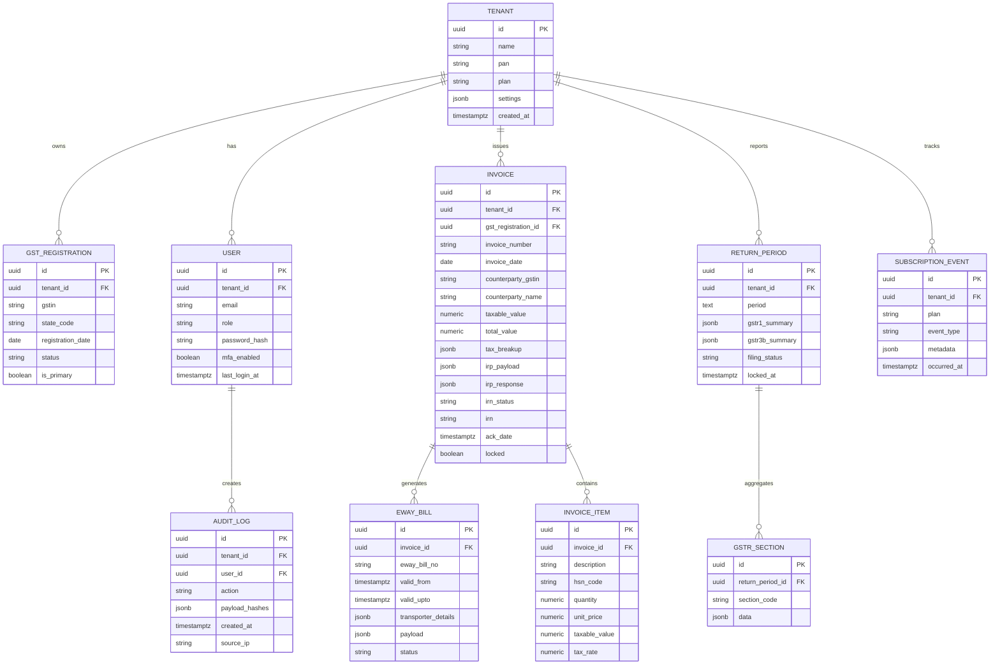

# Data Model & SQL Schema

## Entity Relationship Diagram



## PostgreSQL Schema Snippets

```sql
CREATE TABLE tenants (
  id UUID PRIMARY KEY,
  name TEXT NOT NULL,
  pan CHAR(10) NOT NULL CHECK (pan ~ '^[A-Z]{5}[0-9]{4}[A-Z]$'),
  plan TEXT NOT NULL CHECK (plan IN ('starter','growth','enterprise')),
  settings JSONB DEFAULT '{}'::jsonb,
  created_at TIMESTAMPTZ NOT NULL DEFAULT NOW()
);

CREATE TABLE gst_registrations (
  id UUID PRIMARY KEY,
  tenant_id UUID NOT NULL REFERENCES tenants(id) ON DELETE CASCADE,
  gstin CHAR(15) NOT NULL,
  state_code CHAR(2) NOT NULL,
  registration_date DATE,
  status TEXT NOT NULL CHECK (status IN ('active','cancelled','suspended','pending')),
  is_primary BOOLEAN NOT NULL DEFAULT FALSE,
  UNIQUE (tenant_id, gstin)
);

CREATE TABLE users (
  id UUID PRIMARY KEY,
  tenant_id UUID NOT NULL REFERENCES tenants(id) ON DELETE CASCADE,
  email CITEXT NOT NULL,
  role TEXT NOT NULL CHECK (role IN ('admin','accountant','viewer')),
  password_hash TEXT NOT NULL,
  mfa_enabled BOOLEAN NOT NULL DEFAULT TRUE,
  last_login_at TIMESTAMPTZ,
  UNIQUE (tenant_id, email)
);

CREATE TABLE invoices (
  id UUID PRIMARY KEY,
  tenant_id UUID NOT NULL REFERENCES tenants(id) ON DELETE CASCADE,
  gst_registration_id UUID NOT NULL REFERENCES gst_registrations(id),
  invoice_number TEXT NOT NULL,
  invoice_date DATE NOT NULL,
  counterparty_gstin CHAR(15) NOT NULL,
  counterparty_name TEXT,
  place_of_supply CHAR(2) NOT NULL,
  taxable_value NUMERIC(14,2) NOT NULL,
  total_value NUMERIC(14,2) NOT NULL,
  tax_breakup JSONB NOT NULL,
  irp_payload JSONB,
  irp_response JSONB,
  irn_status TEXT NOT NULL DEFAULT 'pending',
  irn TEXT,
  ack_no TEXT,
  ack_date TIMESTAMPTZ,
  qr_code TEXT,
  signed_invoice TEXT,
  locked BOOLEAN NOT NULL DEFAULT FALSE,
  created_at TIMESTAMPTZ NOT NULL DEFAULT NOW(),
  CHECK (irn_status IN ('pending','success','failed'))
);

CREATE TABLE invoice_items (
  id UUID PRIMARY KEY,
  invoice_id UUID NOT NULL REFERENCES invoices(id) ON DELETE CASCADE,
  description TEXT NOT NULL,
  hsn_code TEXT NOT NULL,
  quantity NUMERIC(12,3) NOT NULL,
  unit_price NUMERIC(14,2) NOT NULL,
  taxable_value NUMERIC(14,2) NOT NULL,
  tax_rate NUMERIC(5,2) NOT NULL
);

CREATE TABLE eway_bills (
  id UUID PRIMARY KEY,
  invoice_id UUID NOT NULL REFERENCES invoices(id) ON DELETE CASCADE,
  eway_bill_no TEXT NOT NULL,
  valid_from TIMESTAMPTZ NOT NULL,
  valid_upto TIMESTAMPTZ NOT NULL,
  transporter_details JSONB NOT NULL,
  payload JSONB NOT NULL,
  status TEXT NOT NULL CHECK (status IN ('active','cancelled','expired'))
);

CREATE TABLE return_periods (
  id UUID PRIMARY KEY,
  tenant_id UUID NOT NULL REFERENCES tenants(id) ON DELETE CASCADE,
  period TEXT NOT NULL,
  gstr1_summary JSONB NOT NULL,
  gstr3b_summary JSONB NOT NULL,
  filing_status TEXT NOT NULL CHECK (filing_status IN ('draft','locked','filed')),
  locked_at TIMESTAMPTZ,
  UNIQUE (tenant_id, period)
);

CREATE TABLE gstr_sections (
  id UUID PRIMARY KEY,
  return_period_id UUID NOT NULL REFERENCES return_periods(id) ON DELETE CASCADE,
  section_code TEXT NOT NULL,
  data JSONB NOT NULL,
  UNIQUE (return_period_id, section_code)
);

CREATE TABLE audit_logs (
  id UUID PRIMARY KEY,
  tenant_id UUID NOT NULL REFERENCES tenants(id) ON DELETE CASCADE,
  user_id UUID REFERENCES users(id),
  action TEXT NOT NULL,
  payload_hashes JSONB NOT NULL,
  source_ip INET,
  created_at TIMESTAMPTZ NOT NULL DEFAULT NOW()
);

CREATE TABLE subscription_events (
  id UUID PRIMARY KEY,
  tenant_id UUID NOT NULL REFERENCES tenants(id) ON DELETE CASCADE,
  plan TEXT NOT NULL,
  event_type TEXT NOT NULL CHECK (event_type IN ('trial_started','activated','renewed','suspended','cancelled')),
  metadata JSONB,
  occurred_at TIMESTAMPTZ NOT NULL DEFAULT NOW()
);
```
