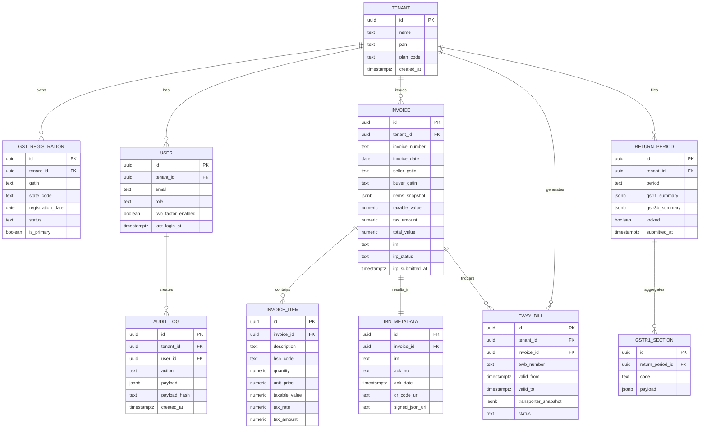

# Data Model & ERD

## Notes
- `jsonb` columns keep the immutable snapshot of the payloads sent to IRP, e-way bill APIs, and return submissions.
- Hashes are stored in `AUDIT_LOG.payload_hash` to make tampering evident.
- `RETURN_PERIOD.locked` becomes immutable once filings are uploaded to the GST portal to mimic upcoming GSTN behaviour.
