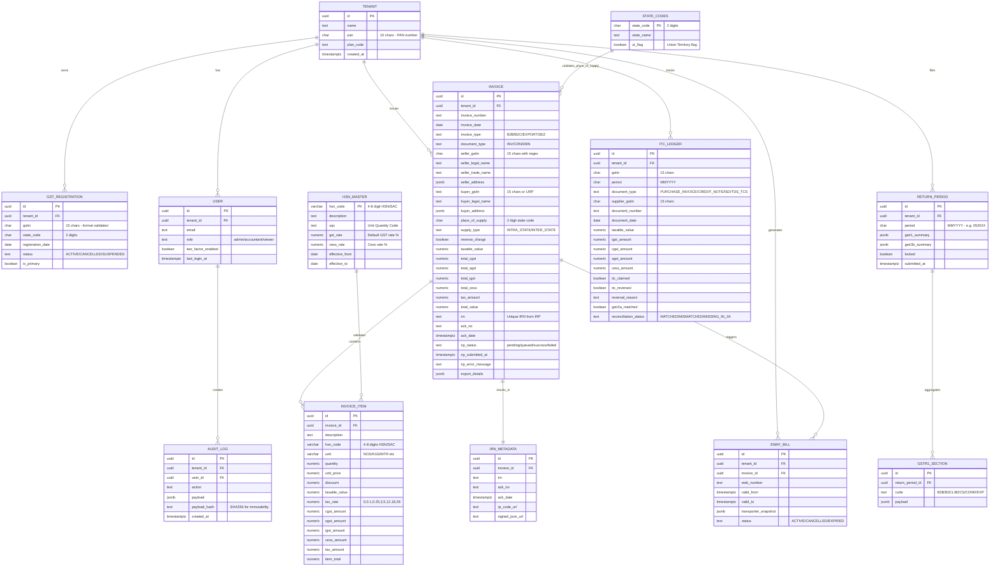

# Data Model & ERD

## Notes
- **GSTIN validation**: All GSTIN fields enforce the 15-character format: `^\d{2}[A-Z]{5}\d{4}[A-Z]{1}[A-Z\d]{1}[Z]{1}[A-Z\d]{1}$`
- **Tax split logic**: For intra-state supplies, CGST + SGST; for inter-state, only IGST. Check constraint ensures `(cgst + sgst = 0) OR (igst = 0)`.
- **HSN codes**: 4-digit (chapter level) to 8-digit (item level). Services use SAC (Service Accounting Code), same structure.
- **ITC ledger**: Tracks Input Tax Credit from purchases. GSTR-2A auto-populated by suppliers' GSTR-1. Reconciliation status tracks matching.
- **Return periods**: GSTR-1 (outward supplies) and GSTR-3B (monthly return with tax payment) summaries stored as JSONB for flexibility.
- **Immutability**: `AUDIT_LOG.payload_hash` uses SHA-256. `RETURN_PERIOD.locked` prevents modifications post-filing.
- **State codes**: Full list of Indian states/UTs with 2-digit codes (01-38, 97, 99). Used for place of supply validation and tax jurisdiction determination.
